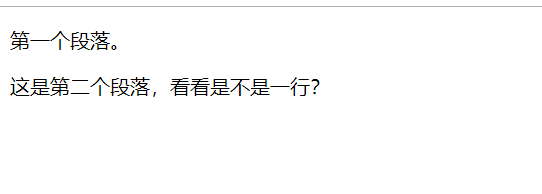
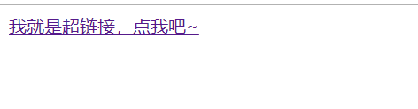

<div align="center">
  <h2><a name="head"></a>📖</h2>
</div>  
<div align="center">
  HTML(在更) / <a href="https://github.com/fmw666/Front-end/blob/master/CSS/README.md#head">CSS(在更)</a> / <a href="https://github.com/fmw666/Front-end/blob/master/JavaScript/README.md#head">JavaScript(在更)</a> / <a href="#">BootStrap</a> / <a href="#">jQuery</a>
</div>

<br>

# HTML 指南

>> 文档为本人所有，如需要转载请先[联系我](https://github.com/fmw666)，⚡特此说明！
<hr/>

*"HTML(HyperText Markup Language)--超文本标记语言，标准通用标记语言下的一个应用。是网页制作必备的编程语言"*


🏷前端学习参考网站
 - [RUNOOB](http://www.runoob.com/)
 - [W3school](http://www.w3school.com.cn/index.html)

## 目录

1. [第一个html文档解析](#第一个html文档解析)
1. [HTML 标题](#HTML-标题)
1. [HTML 段落](#4)
1. [HTML 超链接](#5)

## 第一个html文档解析

  <a name="1.1"></a>
  - [1.1](#1.1) **html基本结构**
  
    ```sass
    <!DOCTYPE html>
    <html>
    <head>
        <title>我是网页标题</title>
    </head>
    <body>
        <h1>我是内容标题</h1>
        <p>我是段落</p>
        <!-- 我是注释 -->
    </body>
    </html>
    ```
    
  <a name="1.2"></a>
  - [1.2](#1.2) **`<!DOCTYPE html>` 声明为 HTML5 文档**
  
    + 🎲 [\<!DOCTYPE\>]((#no-jump)) 声明必须是 HTML 文档的第一行，位于 [\<html\>](#no-jump) 标签之前。
    
    + 🎲 向 HTML 文档添加 [\<!DOCTYPE\>](#no-jump) 声明，这样浏览器才能获知文档类型。
    
    + 🎲 [\<!DOCTYPE\>](#no-jump) 声明没有结束标签，并且对大小写不敏感。
    
    + 🎲 HTML5 中只有一种 [\<!DOCTYPE\>](#no-jump) 声明（在 HTML 4.01 中有三种），即：
      ```sass
      <!DOCTYPE html>
      ```
  
  <a name="1.3"></a>
  - [1.3](#1.3) **`<html>` 元素是 HTML 页面的根元素**
  
    + 🕹 [\<html\>](#no-jump) 与 [\</html\>](#no-jump) 标签限定了文档的开始点和结束点。
    
    + 🕹 它们之间是文档的头部和主体，即 [\<head\>](#no-jump) 和 [\<body\>](#no-jump) 标签里的内容。
    
    <div align="center">
      
    </div>
  
  <a name="1.4"></a>
  - [1.4](#1.4) **`<head>` 元素包含了文档的元（meta）数据**
  
    + 💸 [\<head\>](#no-jump) 标签用于定义文档的头部，它是所有头部元素的容器。
    
    + 💸 [\<head\>](#no-jump) 中的元素可以引用脚本、指示浏览器在哪里找到样式表、提供元信息等等。
    
    + 💸 文档的头部描述了文档的各种属性和信息，包括文档的标题、在 Web 中的位置以及和其他文档的关系等。绝大多数文档头部包含的数据都不会真正作为内容显示给读者。
    
    + 💸 下面这些标签可用在 [head](#no-jump) 部分：[\<base\>](#no-jump), [\<link\>](#no-jump), [\<meta\>](#no-jump), [\<script\>](#no-jump), [\<style\>](#no-jump), 以及 [\<title\>](#no-jump)。
    
    + 💸 [\<head\>](#no-jump) 标签放在文档的开始处，紧跟在 [\<html\>](#no-jump) 后面，并处于 [\<body\>](#no-jump) 标签之前。
    
    <div align="center">
      
    </div>
  
  <a name="1.5"></a>
  - [1.5](#1.5) **`<title>` 元素描述了文档的标题**
  
    &emsp;&emsp;💡 浏览器会以特殊的方式来使用标题，并且通常把它放置在浏览器窗口的标题栏或状态栏上。同样，当把文档加入用户的链接列表或者收藏夹或书签列表时，标题将成为该文档链接的默认名称。
    
    <div align="center">
      
    </div>
    
  <a name="1.6"></a>
  - [1.6](#1.6) **`<body>` 元素包含了可见的页面内容(下面讲解的标签基本都写在这个标签里)**
  
    + 🎈 [body](#no-jump) 元素定义文档的主体。 
    
    + 🎈 [body](#no-jump) 元素包含文档的所有内容（比如文本、超链接、图像、表格和列表等等。）
    
    <div align="center">
      
    </div>
    
  <a name="1.7"></a>
  - [1.7](#1.7) **`<!-- -->` 标签里为注释内容**
  
    &emsp;&emsp;🎗 注释可以提高程序的可读性，使代码更容易被别人理解。在大多数编译器里，可通过快捷键 [ctrl](#no-jump) + [/](#no-jump) 来注释一行。
    
    <div align="center">
      
    </div>
  
**[⬆ back to top](#目录)**

## HTML 标题

  <a name="2.1"></a>
  - [2.1](#2.1) **HTML 标题（Heading）通过 `<h1> - <h6>` 等标签定义**
  
    ```sass
    <h1>这是一级标题，很大那种</h1>
    <h2>这是二级标题，也很大</h2>
    <h3>这是三级标题，还好</h3>
    <h4>这是四级标题，大</h4>
    <h5>这是五级小标题</h5>
    <h6>这是六级标题</h6>
    ```
    
    
    
  <a name="2.2"></a>
  - [2.2](#2.2) **标题的重要性及作用**
  
    + 📚 请确保将 HTML 标题 标签只用于标题。不要仅仅是为了生成粗体或大号的文本而使用标题。
    
    + 📚 搜索引擎使用标题为您的网页的结构和内容编制索引。
    
    + 📚 因为用户可以通过标题来快速浏览您的网页，所以用标题来呈现文档结构是很重要的。
    
    + 📚 应该将 h1 用作主标题（最重要的），其后是 h2（次重要的），再其次是 h3，以此类推。
    
    <div align="center">
      
    </div>
    
  <a name="2.3"></a>
  - [2.3](#2.3) **HTML 水平线**
  
    使用 [\<hr\>](#no-jump) 标签在 HTML 页面中创建水平线。
    
    ```sass
    <h4>这是第一个h4标题</h4>
    <hr>    <!-- 也可以写成<hr /> -->
    <h4>这是第二个h4标题</h4>
    ```
    
    
  
**[⬆ back to top](#目录)**

<a name="4"></a>
+ **HTML 段落**

  *HTML 段落是通过标签 `<p>` 来定义的。*
  ```html
  <p>第一个段落。</p>
  <p>这是第二个段落，看看是不是一行？</p>
  ```
  
  
  ---

<a name="5"></a>
+ **HTML 超链接**

  *HTML 链接是通过 `<a>` 标签进行定义的。*
  ```html
  <a href="https://github.com/fmw666/Front-end">我就是超链接，点我吧~</a>
  ```
  
  
  > 链接到的内容在`href`中
