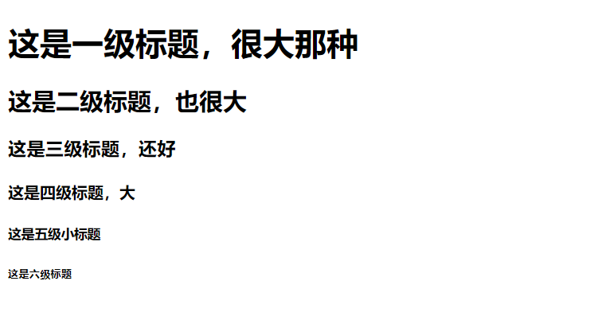

<div align="center">
  <h2><a name="head"></a>📖</h2>
</div>  
<div align="center">
  HTML(在更) / <a href="https://github.com/fmw666/Front-end/blob/master/CSS/README.md#head">CSS(在更)</a> / <a href="https://github.com/fmw666/Front-end/blob/master/JavaScript/README.md#head">JavaScript(在更)</a> / <a href="#">BootStrap</a> / <a href="#">jQuery</a>
</div>

<br>

# HTML--超文本标记语言
#### *📑快捷目录*
[1. 第一个html文档解析](#1)

---

<a name="1"></a>
+ **第一个html文档解析**
  ```html
  <!DOCTYPE html>
  <html>
  <head>

  </head>
  <body>

  </body>
  </html>
  ```
  - `<!DOCTYPE html>`声明为 HTML5 文档
  - `<html>` 元素是 HTML 页面的根元素
  - `<head>` 元素包含了文档的元（meta）数据
  - `<body>` 元素包含了可见的页面内容(下面讲解的标签基本都写在这个标签里)
  
  ---
  
+ **网页标题**

  *网页标题是通过 `<title>` 标签来定义的。*
  ```html
  <title>我是标题</title>
  ```
  <br>
  
  > `<title>` 标签约定放在 `<head>` 标签中
  
  ---
  
+ **HTML 标题**

  *HTML 标题（Heading）是通过 `<h1> - <h6>` 等标签进行定义的。*
  ```html
  <h1>这是一级标题，很大那种</h1>
  <h2>这是二级标题，也很大</h2>
  <h3>这是三级标题，还好</h3>
  <h4>这是四级标题，大</h4>
  <h5>这是五级小标题</h5>
  <h6>这是六级标题</h6>
  ```
  
  
  ---
  
+ **HTML 段落**

  *HTML 段落是通过标签 `<p>` 来定义的。*
  ```html
  <p>第一个段落。</p>
  <p>这是第二个段落，看看是不是一行？</p>
  ```
  
  
  ---

+ **HTML 超链接**

  *HTML 链接是通过 `<a>` 标签进行定义的。*
  ```html
  <a href="https://github.com/fmw666/Front-end">我就是超链接，点我吧~</a>
  ```
  
  
  > 链接到的内容在`href`中
