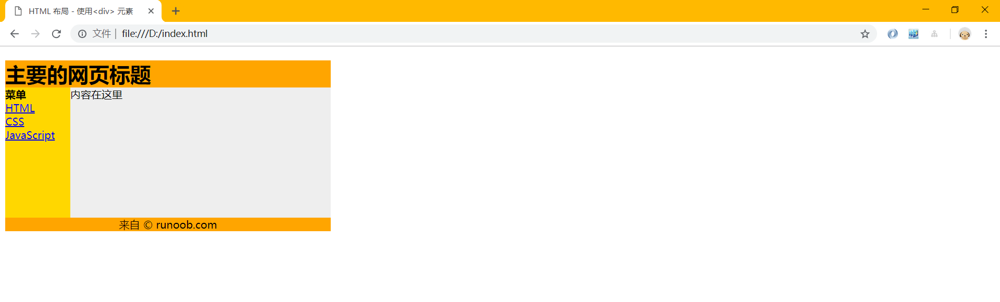
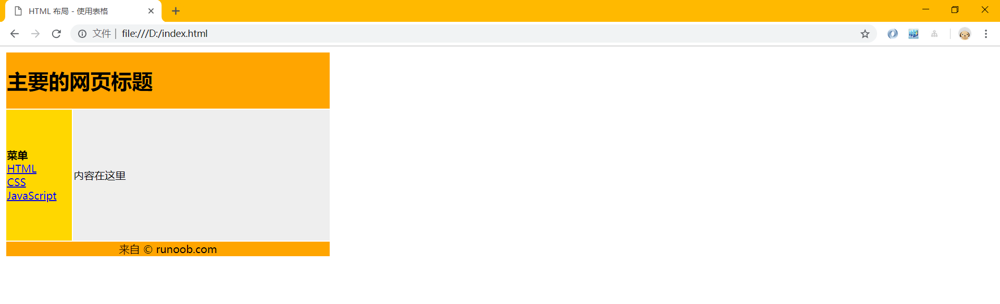

<div align="center">
  <h2><a name="head"></a>📖</h2>
</div>  
<div align="center">
  HTML(在更) / <a href="https://github.com/fmw666/Front-end/blob/master/CSS/README.md#head">CSS(在更)</a> / <a href="https://github.com/fmw666/Front-end/blob/master/JavaScript/README.md#head">JavaScript(在更)</a> / <a href="#">BootStrap</a> / <a href="#">jQuery</a>
</div>

<br>

# HTML 指南

>> 文档为本人所有，如需要转载请先[联系我](https://github.com/fmw666)，⚡特此说明！
<hr/>

*"HTML(HyperText Markup Language)--超文本标记语言，标准通用标记语言下的一个应用。是网页制作必备的编程语言"*


🏷前端学习参考网站
 - [RUNOOB](http://www.runoob.com/)
 - [W3school](http://www.w3school.com.cn/index.html)

## 目录

1. [第一个html文档解析](#第一个html文档解析)
1. [HTML 标题](#HTML-标题)
1. [HTML 段落](#HTML-段落)
1. [HTML 属性](#HTML-属性)
1. [HTML 文本格式化](#HTML-文本格式化)
1. [HTML 超链接](#HTML-超链接)
1. [HTML 头部](#HTML-头部)
1. [HTML 图像](#HTML-图像)
1. [HTML 表格](#HTML-表格)
1. [HTML 列表](#HTML-列表)
1. [HTML 区块](#HTML-区块)
1. [HTML 布局](#HTML-布局)
1. [HTML 表单](#HTML-表单)
1. [HTML 框架](#HTML-框架)
1. [HTML 颜色](#HTML-颜色)
1. [HTML 脚本](#HTML-脚本)
1. [HTML 字符实体](#HTML-字符实体)
1. [HTML URL](#HTML-URL)

## 第一个html文档解析

  <a name="1.1"></a>
  - [1.1](#1.1) **html基本结构**
  
    ```sass
    <!DOCTYPE html>
    <html>
    <head>
        <title>我是网页标题</title>
    </head>
    <body>
        <h1>我是内容标题</h1>
        <p>我是段落</p>
        <!-- 我是注释 -->
    </body>
    </html>
    ```
    
  <a name="1.2"></a>
  - [1.2](#1.2) **`<!DOCTYPE html>` 声明为 HTML5 文档**
  
    + 🎲 [\<!DOCTYPE\>]((#no-jump)) 声明必须是 HTML 文档的第一行，位于 [\<html\>](#no-jump) 标签之前。
    
    + 🎲 向 HTML 文档添加 [\<!DOCTYPE\>](#no-jump) 声明，这样浏览器才能获知文档类型。
    
    + 🎲 [\<!DOCTYPE\>](#no-jump) 声明没有结束标签，并且对大小写不敏感。
    
    + 🎲 HTML5 中只有一种 [\<!DOCTYPE\>](#no-jump) 声明（在 HTML 4.01 中有三种），即：
      ```sass
      <!DOCTYPE html>
      ```
  
  <a name="1.3"></a>
  - [1.3](#1.3) **`<html>` 元素是 HTML 页面的根元素**
  
    + 🕹 [\<html\>](#no-jump) 与 [\</html\>](#no-jump) 标签限定了文档的开始点和结束点。
    
    + 🕹 它们之间是文档的头部和主体，即 [\<head\>](#no-jump) 和 [\<body\>](#no-jump) 标签里的内容。
    
    <div align="center">
      
    </div>
  
  <a name="1.4"></a>
  - [1.4](#1.4) **`<head>` 元素包含了文档的元（meta）数据**
  
    + 💸 [\<head\>](#no-jump) 标签用于定义文档的头部，它是所有头部元素的容器。
    
    + 💸 [\<head\>](#no-jump) 中的元素可以引用脚本、指示浏览器在哪里找到样式表、提供元信息等等。
    
    + 💸 文档的头部描述了文档的各种属性和信息，包括文档的标题、在 Web 中的位置以及和其他文档的关系等。绝大多数文档头部包含的数据都不会真正作为内容显示给读者。
    
    + 💸 下面这些标签可用在 [head](#no-jump) 部分：[\<base\>](#no-jump), [\<link\>](#no-jump), [\<meta\>](#no-jump), [\<script\>](#no-jump), [\<style\>](#no-jump), 以及 [\<title\>](#no-jump)。
    
    + 💸 [\<head\>](#no-jump) 标签放在文档的开始处，紧跟在 [\<html\>](#no-jump) 后面，并处于 [\<body\>](#no-jump) 标签之前。
    
    <div align="center">
      
    </div>
  
  <a name="1.5"></a>
  - [1.5](#1.5) **`<title>` 元素描述了文档的标题**
  
    &emsp;&emsp;💡 浏览器会以特殊的方式来使用标题，并且通常把它放置在浏览器窗口的标题栏或状态栏上。同样，当把文档加入用户的链接列表或者收藏夹或书签列表时，标题将成为该文档链接的默认名称。
    
    <div align="center">
      
    </div>
    
  <a name="1.6"></a>
  - [1.6](#1.6) **`<body>` 元素包含了可见的页面内容(下面讲解的标签基本都写在这个标签里)**
  
    + 🎈 [body](#no-jump) 元素定义文档的主体。 
    
    + 🎈 [body](#no-jump) 元素包含文档的所有内容（比如文本、超链接、图像、表格和列表等等。）
    
    <div align="center">
      
    </div>
    
  <a name="1.7"></a>
  - [1.7](#1.7) **`<!-- -->` 标签里为注释内容**
  
    &emsp;&emsp;🎗 注释可以提高程序的可读性，使代码更容易被别人理解。在大多数编译器里，可通过快捷键 [ctrl](#no-jump) + [/](#no-jump) 来注释一行。
    
    <div align="center">
      
    </div>
  
**[⬆ back to top](#目录)**

## HTML 标题

  <a name="2.1"></a>
  - [2.1](#2.1) **HTML 标题（Heading）通过 `<h1> - <h6>` 等标签定义**
  
    ```sass
    <h1>这是一级标题，很大那种</h1>
    <h2>这是二级标题，也很大</h2>
    <h3>这是三级标题，还好</h3>
    <h4>这是四级标题，大</h4>
    <h5>这是五级小标题</h5>
    <h6>这是六级标题</h6>
    ```
    
    
    
  <a name="2.2"></a>
  - [2.2](#2.2) **标题的重要性及作用**
  
    + 📚 请确保将 HTML 标题 标签只用于标题。不要仅仅是为了生成粗体或大号的文本而使用标题。
    
    + 📚 搜索引擎使用标题为您的网页的结构和内容编制索引。
    
    + 📚 因为用户可以通过标题来快速浏览您的网页，所以用标题来呈现文档结构是很重要的。
    
    + 📚 应该将 h1 用作主标题（最重要的），其后是 h2（次重要的），再其次是 h3，以此类推。
    
    <div align="center">
      
    </div>
    
  <a name="2.3"></a>
  - [2.3](#2.3) **HTML 水平线**
  
    🎯 使用 [\<hr\>](#no-jump) 标签在 HTML 页面中创建水平线。
    
    ```sass
    <h4>这是第一个h4标题</h4>
    <hr>    <!-- 也可以写成<hr /> -->
    <h4>这是第二个h4标题</h4>
    ```
    
    
  
**[⬆ back to top](#目录)**

## HTML 段落

  <a name="3.1"></a>
  - [3.1](#3.1) **HTML 段落通过标签 `<p>` 定义**
  
    ```sass
    <p>这是第一个段落。</p>
    <p>这是第二个段落，看看和第一段是不是一行？</p>
    ```
    
    
    
  <a name="3.2"></a>
  - [3.2](#3.2) **HTML 通过标签 `<br>` 标签进行换行**
  
    ```sass
    <p>如果不被换行<br>我们本来是一段的<br>呜呜</p>
    ```
    
    
    
  <a name="3.3"></a>
  - [3.3](#3.3) **HTML 格式--关于空格问题**
  
    🚀 当显示页面时，浏览器会移除源代码中多余的空格和空行。所有连续的空格或空行都会被算作一个空格。比如如下例子：
  
    ```sass
    <p>I'm           fmw</p>
    ```
  
    
    
**[⬆ back to top](#目录)**

## HTML 属性

  <a name="4.1"></a>
  - [4.1](#4.1) **属性是 HTML 元素提供的附加信息**
  
    + 🥢 属性一般描述于开始标签。如 HTML 链接由 [\<a\>](#no-jump) 标签定义，链接的地址在 [href](#no-jump) 属性中指定。
    
      ```sass
      <a href="https://github.com/fmw666">我就是超链接，点击我即可跳转页面！</a>
      ```
    
    + 🥢 属性总是以名称/值对的形式出现，比如：`name="value"`
    
    + 🥢 属性值应该始终被包括在引号内，双引号是最常用的，不过使用单引号也没有问题。
    
    + 🥢 如果属性值本身就含有双引号，那么必须使用单引号，例如：`name='John "ShotGun" Nelson'`
    
    <div align="center">
      
    </div>
    
  <a name="4.2"></a>
  - [4.2](#4.2) **HTML 属性参考手册**
  
    🍦 下面列出了适用于大多数 HTML 元素的属性：
    
      |属性|描述|
      |:--:|:--|
      |class|为html元素定义一个或多个类名（classname）(类名从样式文件引入)|
      |id|定义元素的唯一id|
      |style|规定元素的行内样式（inline style）|
      |title|描述了元素的额外信息 (作为工具条使用)|
     
**[⬆ back to top](#目录)**
    
## HTML 文本格式化

  <a name="5.1"></a>
  - [5.1](#5.1) **HTML 格式化标签**
  
    + 📚 HTML 使用标签 [\<b\>](#no-jump)("bold") 与 [\<i\>](#no-jump)("italic") 对输出的文本进行格式，如：**粗体** or *斜体*
    
      > 通常标签 [\<strong\>](#no-jump) 替换加粗标签 [\<b\>](#no-jump) 来使用， [\<em\>](#no-jump) 替换 [\<i\>](#no-jump) 标签使用。[\<strong\>](#no-jump) 或者 [\<em\>](#no-jump) 意味着你要呈现的文本是重要的，所以要突出显示。

    + 📚 这些 HTML 标签被称为格式化标签（请查看下方完整标签参考手册）。
    
    <div align="center">
      
    </div>
    
  <a name="5.2"></a>
  - [5.2](#5.2) **HTML 文本格式化标签**
  
    |标签|描述|
    |:---|:------|
    |[\<b\>](#no-jump)|定义粗体文本|
    |[\<em\>](#no-jump)|定义着重文字|
    |[\<i\>](#no-jump)|定义斜体字|
    |[\<small\>](#no-jump)|定义小号字|
    |[\<strong\>](#no-jump)|定义加重语气|
    |[\<sub\>](#no-jump)|定义下标字|
    |[\<sup\>](#no-jump)|定义上标字|
    |[\<ins\>](#no-jump)|定义插入字|
    |[\<del\>](#no-jump)|定义删除字|
    
  <a name="5.3"></a>
  - [5.3](#5.3) **HTML "计算机输出" 标签**
  
    |标签|描述|
    |:---|:------|
    |[\<code\>](#no-jump)|定义计算机代码|
    |[\<kbd\>](#no-jump)|定义键盘码|
    |[\<samp\>](#no-jump)|定义计算机代码样本|
    |[\<var\>](#no-jump)|定义变量|
    |[\<pre\>](#no-jump)|定义预格式文本|
    
  <a name="5.4"></a>
  - [5.4](#5.4) **HTML 引文、引用、及标签定义**
  
    |标签|描述|
    |:---|:------|
    |[\<abbr\>](#no-jump)|定义缩写|
    |[\<address\>](#no-jump)|定义地址|
    |[\<bdo\>](#no-jump)|定义文字方向|
    |[\<blockquote\>](#no-jump)|定义长的引用|
    |[\<q\>](#no-jump)|定义短的引用语|
    |[\<cite\>](#no-jump)|定义引用、引证|
    |[\<dfn\>](#no-jump)|	定义一个定义项目|

**[⬆ back to top](#目录)**

## HTML 超链接
    
  <a name="6.1"></a>
  - [6.1](#6.1) **HTML 超链接通过标签 `<a>` 定义**
  
    + 🏹 超链接可以是一个字，一个词，或者一组词，也可以是一幅图像，您可以点击这些内容来跳转到新的文档或者当前文档中的某个部分。
    
    + 🏹 当您把鼠标指针移动到网页中的某个链接上时，箭头会变为一只小手。
    
    + 🏹 在标签<a> 中使用了href属性来描述链接的地址。
  
      ```sass
      <a href="url">链接文本</a>
      ```

    <div align="center">
      
    </div>
    
  <a name="6.2"></a>
  - [6.2](#6.2) **HTML 超链接 -- target 属性**
  
    📁 使用 target 属性，你可以定义被链接的文档在何处显示。
    
    ```sass
    <a href="https://fmw666.github.io/" target="_blank">访问我的博客!</a>
    ```
    
  <a name="6.3"></a>
  - [6.3](#6.3) **HTML 超链接 -- id 属性**
  
    + 🎧 id 属性可用于创建在一个 HTML 文档书签标记。
    
    + 🎧 在 HTML 文档中插入 id:
    
      ```sass
      <a id="tips">有用的提示部分</a>
      ```
      
    + 🎧 在 HTML 文档中创建一个链接到"有用的提示部分(id="tips"）"：
    
      ```sass
      <a href="#tips">访问有用的提示部分</a>
      ```
      
    + 🎧 或者，从另一个页面创建一个链接到"有用的提示部分(id="tips"）"：
    
      ```sass
      <a href="https://github.com/fmw666/Front-end/tree/master/HTML#tips">访问有用的提示部分</a>
      ```
      
    <div align="center">
      
    </div>
    
**[⬆ back to top](#目录)** 

## HTML 头部

  <a name="7.1"></a>
  - [7.1](#7.1) **HTML `<head>` 元素**
  
    + 🎓 [\<head\>](#no-jump) 元素包含了所有的头部标签元素。
    
    + 🎓 在 [\<head\>](#no-jump) 元素中你可以插入脚本（scripts）, 样式文件（CSS），及各种 meta 信息。
    
    + 🎓 可以在头部区域添加的元素标签为: [\<title\>](#no-jump)、[\<style\>](#no-jump)、[\<meta\>](#no-jump)、[\<link\>](#no-jump)、[\<script\>](#no-jump)、[\<noscript\>](#no-jump)、[\<base\>](#no-jump)
    
      |标签|描述|
      |:---|:------|
      |[\<title\>](#no-jump)|定义了文档的标题|
      |[\<style\>](#no-jump)|定义了HTML文档的样式文件|
      |[\<meta\>](#no-jump)|定义了HTML文档中的元数据|
      |[\<link\>](#no-jump)|定义了一个文档和外部资源之间的关系|
      |[\<script\>](#no-jump)|定义了客户端的脚本文件|
      |[\<base\>](#no-jump)|定义了页面链接标签的默认链接地址|
      
  <a name="7.2"></a>
  - [7.2](#7.2) **HTML `<base>` 元素**
  
    📌 [\<base\>](#no-jump) 标签描述了基本的链接地址/链接目标，该标签作为 HTML 文档中所有的链接标签的默认链接：
    
      ```sass
      <head>
          <base href="https://fmw666.github.io/" target="_blank">
      </head>
      ```
      
  <a name="7.3"></a>
  - [7.3](#7.3) **HTML `<link>` 元素**
  
    + ⌛ [\<link\>](#no-jump) 标签定义了文档与外部资源之间的关系。
    
    + ⌛ [\<link\>](#no-jump) 标签通常用于链接到样式表：
    
      ```sass
      <head>
      <link rel="stylesheet" type="text/css" href="my-style.css">
      </head>
      ```
      
  <a name="7.4"></a>
  - [7.4](#7.4) **HTML `<style>` 元素**
  
    + [\<style\>](#no-jump) 标签定义了 HTML 文档的样式文件引用地址。
    
    + 在 [\<style\>](#no-jump) 元素中你也可以直接添加样式来渲染 HTML 文档：
    
      ```sass
      <head>
          <style type="text/css">
              body{
                  background-color:yellow;
              }
              p{
                  color: blue;
              }
          </style>
      </head>
      ```
      
  <a name="7.5"></a>
  - [7.5](#7.5) **HTML `<meta>` 元素**
  
    + [\<meta\>](#no-jump) 标签描述了一些基本的元数据。
    
    + [\<meta\>](#no-jump) 标签提供了元数据。元数据也不显示在页面上，但会被浏览器解析。

    + meta 元素通常用于指定网页的描述、关键词、文件的最后修改时间、作者、和其他元数据。
    
    + 为搜索引擎定义关键词：
    
      ```sass
      <meta name="keywords" content="HTML, CSS, XML, XHTML, JavaScript">
      ```
      
    + 为网页定义描述内容：
    
      ```sass
      <meta name="description" content="Web & 编程 教程">
      ```
      
    + 定义网页作者：
    
      ```sass
      <meta name="author" content="fmw666">
      ```
      
    + 每30秒钟刷新当前页面：
    
      ```sass
      <meta http-equiv="refresh" content="30">
      ```
      
  <a name="7.6"></a>
  - [7.6](#7.6) **HTML `<script>` 元素**
  
    📜 [\<script\>](#no-jump) 标签用于加载脚本文件，如： [JavaScript](#no-jump)。（后续会专门讲解）
    
    <div align="center">
      
    </div>
    
**[⬆ back to top](#目录)** 

## HTML 图像

  <a name="8.1"></a>
  - [8.1](#8.1) **HTML 图像 -- 图像标签（ `` ）和源属性（src）**
  
    + 在 HTML 中，图像由 [\](#no-jump) 标签定义。[\](#no-jump) 是空标签，意思是说，它只包含属性，并且没有闭合标签。
    
    + 要在页面上显示图像，你需要使用源属性（src）。[src](#no-jump) 指 "source"。源属性的值是图像的 URL 地址。
    
      ```sass
      
      ```
      
  <a name="8.2"></a>
  - [8.2](#8.2) **HTML 图像 -- alt属性** 
  
    + [alt](#no-jump) 属性用来为图像定义一串预备的可替换的文本，替换文本属性的值是用户定义的。
    
    + 在浏览器无法载入图像时，替换文本属性告诉读者她们失去的信息。此时，浏览器将显示这个替代性的文本而不是图像。为页面上的图像都加上替换文本属性是个好习惯，这样有助于更好的显示信息，并且对于那些使用纯文本浏览器的人来说是非常有用的。
    
      ```sass
      
      ```
      
  <a name="8.3"></a>
  - [8.3](#8.3) **HTML 图像 -- 设置图像的高度与宽度** 
  
    📯 [height](#no-jump)（高度） 与 [width](#no-jump)（宽度）属性用于设置图像的高度与宽度。指定图像的高度和宽度是一个很好的习惯，如果没有指定图片的大小，加载页面时有可能会破坏HTML页面的整体布局。属性值默认单位为像素：
    
      ```sass
      
      ```
      
    <div align="center">
      
    </div>

**[⬆ back to top](#目录)** 

## HTML 表格

  <a name="9.1"></a>
  - [9.1](#9.1) **HTML 表格由 `<table>` 标签来定义** 
  
    🎈 每个表格均有若干行（由 [\<tr\>](#no-jump) 标签定义），每行被分割为若干单元格（由 [\<td\>](#no-jump) 标签定义）。字母 [\<td\>](#no-jump) 指表格数据（table data），即数据单元格的内容。数据单元格可以包含文本、图片、列表、段落、表单、水平线、表格等等。
    
    ```sass
    <table>
        <tr>
            <td>一行一列</td>
            <td>一行二列</td>
        </tr>
        <tr>
            <td>二行一列</td>
            <td>二行二列</td>
        </tr>
    </table>
    ```
    
  <a name="9.2"></a>
  - [9.2](#9.2) **HTML 表格和边框属性**
  
    🎈 如果不定义边框属性，表格将不显示边框。有时这很有用，但是大多数时候，我们希望显示边框。使用边框属性来显示一个带有边框的表格(默认单位像素)：
    
    ```sass
    <table border="1">
        <tr>
            <td>一行一列</td>
            <td>一行二列</td>
        </tr>
    </table>
    ```
    
  <a name="9.3"></a>
  - [9.3](#9.3) **HTML 表格表头通过标签 `<th>` 定义**
  
    🎈 大多数浏览器会把表头显示为粗体居中的文本：
    
    ```sass
    <table border="1">
        <tr>
            <th>标题一</th>
            <th>标题二</th>
        </tr>
        <tr>
            <td>一行一列</td>
            <td>一行二列</td>
        </tr>
        <tr>
            <td>二行一列</td>
            <td>二行二列</td>
        </tr>
    </table>
    ```
  
**[⬆ back to top](#目录)**  

## HTML 列表

  <a name="10.1"></a>
  - [10.1](#10.1) **HTML 无序列表**
  
    👑 无序列表是一个项目的列表，此列项目使用粗体圆点（典型的小黑圆圈）进行标记。无序列表使用 [\<ul\>](#no-jump) 标签：
    
    ```sass
    <ul>
        <li>列表一</li>
        <li>列表二</li>
    </ul>
    ```
    
  <a name="10.2"></a>
  - [10.2](#10.2) **HTML 有序列表** 
  
    👑 有序列表也是一列项目，列表项目使用数字进行标记。 有序列表始于 [\<ol\>](#no-jump) 标签。每个列表项始于 [\<li\>](#no-jump) 标签：
    
    ```sass
    <ol>
        <li>列表一</li>
        <li>列表二</li>
    </ol>
    ```
    
  <a name="10.3"></a>
  - [10.3](#10.3) **HTML 自定义列表**
  
    👑 自定义列表不仅仅是一列项目，而是项目及其注释的组合。自定义列表以 [\<dl\>](#no-jump) 标签开始，每个自定义列表项以 [\<dt\>](#no-jump) 开始，每个自定义列表项的定义以 <dd> 开始：
    
    ```sass
    <dl>
        <dt>definition title</dt>
        <dd>definition data</dd>
        <dt>definition title</dt>
        <dd>definition data</dd>
    </dl>
    ```
    
  <a name="10.4"></a>
  - [10.4](#10.4) **HTML 列表标签**
  
    |标签|描述|
    |:---|:------|
    |[\<ol\>](#no-jump)|定义有序列表|
    |[\<ul\>](#no-jump)|定义无序列表|
    |[\<li\>](#no-jump)|定义列表项|
    |[\<dl\>](#no-jump)|定义列表|
    |[\<dt\>](#no-jump)|自定义列表项目|
    |[\<dd\>](#no-jump)|定义自定列表项的描述|
    
**[⬆ back to top](#目录)**  

## HTML 区块

  <a name="11.1"></a>
  - [11.1](#11.1) **HTML 区块元素**
  
    + 🎲 大多数 HTML 元素被定义为块级元素或内联元素。
    
    + 🎲 块级元素在浏览器显示时，通常会以新行来开始（和结束）。
    
    + 🎲 实例: [\<h1\>](#no-jump), [\<p\>](#no-jump), [\<ul\>](#no-jump), [\<table\>](#no-jump)
    
  <a name="11.2"></a>
  - [11.2](#11.2) **HTML 内联元素**
  
    + 🕹 内联元素在显示时通常不会以新行开始。
    
    + 🕹 实例: [\<b\>](#no-jump), [\<td\>](#no-jump), [\<a\>](#no-jump), [\](#no-jump)
    
  <a name="11.3"></a>
  - [11.3](#11.3) **HTML `<div>` 元素**
  
    + 💸 HTML [\<div\>](#no-jump) 元素是块级元素，它可用于组合其他 HTML 元素的容器。
    
    + 💸 [\<div\>](#no-jump) 元素没有特定的含义。除此之外，由于它属于块级元素，浏览器会在其前后显示折行。
  
    + 💸 如果与 [CSS](#no-jump) 一同使用，[\<div\>](#no-jump) 元素可用于对大的内容块设置样式属性。
    
  <a name="11.4"></a>
  - [11.4](#11.4) **HTML `<span>` 元素**
  
    + 💡 HTML [\<span\>](#no-jump) 元素是内联元素，可用作文本的容器。
  
    + 💡 [\<span\>](#no-jump) 元素当与 [CSS](#no-jump) 一同使用时，[\<span\>](#no-jump) 元素可用于为部分文本设置样式属性。
    
  <a name="11.5"></a>
  - [11.5](#11.5) **HTML 分组标签**
  
    |标签|描述|
    |:---|:------|
    |[\<div\>](#no-jump)|定义了文档的区域，块级 (block-level)|
    |[\<span\>](#no-jump)|用来组合文档中的行内元素， 内联元素(inline)|
    
**[⬆ back to top](#目录)**  

## HTML 布局

  <a name="12.1"></a>
  - [12.1](#12.1) **HTML 布局 - 使用 `<div>` 元素**
  
    ```sass
    <!DOCTYPE html>
    <html>

    <head>
        <meta charset="utf-8">
        <title>HTML 布局 - 使用<div> 元素</title>
    </head>

    <body>

        <div id="container" style="width:500px">

            <div id="header" style="background-color:#FFA500;">
                <h1 style="margin-bottom:0;">主要的网页标题</h1>
            </div>

            <div id="menu" style="background-color:#FFD700;height:200px;width:100px;float:left;">
                <b>菜单</b><br>
                <a href="https://github.com/fmw666/Front-end/blob/master/HTML/README.md#head/">HTML</a><br>
                <a href="https://github.com/fmw666/Front-end/blob/master/CSS/README.md#head/">CSS</a><br>
                <a href="https://github.com/fmw666/Front-end/blob/master/JavaScript/README.md#head/">JavaScript</a>
            </div>

            <div id="content" style="background-color:#EEEEEE;height:200px;width:400px;float:left;">
                内容在这里
            </div>

            <div id="footer" style="background-color:#FFA500;clear:both;text-align:center;">
                来自 © runoob.com
            </div>

        </div>

    </body>

    </html>
    ```
    
    
    
  <a name="12.2"></a>
  - [12.2](#12.2) **HTML 布局 - 使用表格**
  
    ```sass
    <!DOCTYPE html>
    <html>

    <head>
        <meta charset="utf-8">
        <title>HTML 布局 - 使用表格</title>
    </head>

    <body>

        <table width="500" border="0">
            <tr>
                <td colspan="2" style="background-color:#FFA500;">
                    <h1>主要的网页标题</h1>
                </td>
            </tr>

            <tr>
                <td style="background-color:#FFD700;width:100px;">
                    <b>菜单</b><br>
                    <a href="https://github.com/fmw666/Front-end/blob/master/HTML/README.md#head/">HTML</a><br>
                    <a href="https://github.com/fmw666/Front-end/blob/master/CSS/README.md#head/">CSS</a><br>
                    <a href="https://github.com/fmw666/Front-end/blob/master/JavaScript/README.md#head/">JavaScript</a>
                </td>
                <td style="background-color:#eeeeee;height:200px;width:400px;">
                    内容在这里</td>
            </tr>

            <tr>
                <td colspan="2" style="background-color:#FFA500;text-align:center;">
                    来自 © runoob.com</td>
            </tr>
        </table>

    </body>

    </html>
    ```
    
    
    
**[⬆ back to top](#目录)**  

## HTML 表单

  <a name="13.1"></a>
  - [13.1](#13.1) **HTML 表单 - 输入元素**
  
    + 表单是一个包含表单元素的区域。
    
    + 表单元素是允许用户在表单中输入内容,比如：文本域(textarea)、下拉列表、单选框(radio-buttons)、复选框(checkboxes)等等。
    
    + 表单使用表单标签 [\<form\>](#no-jump) 来设置:
    
      ```sass
      <form>
      .
      .
      .
      </form>
      ```
      
    + 多数情况下被用到的表单标签是输入标签（[\<input\>](#no-jump)）。
    
    + 输入类型是由类型属性（type）定义的。
    
  <a name="13.2"></a>
  - [13.2](#13.2) **HTML 表单 - 文本域（Text Fields）**
  
    📜 文本域通过 [\<input type="text"\>](#no-jump) 标签来设定，当用户要在表单中键入字母、数字等内容时，就会用到文本域。
    
    ```sass
    <form>
        First name: <input type="text"><br>
        Last  name: <input type="text">
    </form>
    ```
    
  <a name="13.3"></a>
  - [13.3](#13.3) **HTML 表单 - 密码字段**
  
    📜 密码字段通过标签 [\<input type="password"\>](#no-jump) 来定义:
    
    ```sass
    <form>
        Password: <input type="password">
    </form>
    ```
    
  <a name="13.4"></a>
  - [13.4](#13.4) **HTML 表单 - 单选按钮（Radio Buttons）**
  
    📜 [\<input type="radio"\>](#no-jump) 标签定义了表单单选框选项：
    
    ```sass
    <form>
        <input type="radio" name="sex">男<br>
        <input type="radio" name="sex">女
    </form>
    ```
    
  <a name="13.5"></a>
  - [13.5](#13.5) **HTML 表单 - 复选框（Checkboxes）**
  
    📜 [\<input type="checkbox"\>](#no-jump) 定义了复选框，用户需要从若干给定的选择中选取一个或若干选项：
    
    ```sass
    <form>
        <p>我的兴趣：</p>
        <input type="checkbox" name="interest" value="basketball">篮球<br>
        <input type="checkbox" name="interest" value="football">足球
    </form>
    ```
    
  <a name="13.6"></a>
  - [13.6](#13.6) **HTML 表单 - 提交按钮（Submit Button）**
  
    📜 [\<input type="submit"\>](#no-jump) 定义了提交按钮。当用户单击确认按钮时，表单的内容会被传送到另一个文件。表单的动作属性 [action](#no-jump) 定义了目的文件的文件名。由动作属性定义的这个文件通常会对接收到的输入数据进行相关的处理。
    
    ```sass
    <form name="input" action="html_form_action.php" method="get">
        内容: <input type="text" name="content">
        <input type="submit" value="发送">
    </form>
    ```
    
  <a name="13.7"></a>
  - [13.7](#13.7) **HTML 表单标签**
    
    |标签|描述|
    |:---|:------|
    |[\<form\>](#no-jump)|定义供用户输入的表单|
    |[\<input\>](#no-jump)|定义输入域|
    |[\<textarea\>](#no-jump)|定义文本域 (一个多行的输入控件)|
    |[\<label\>](#no-jump)|定义了 [\<input\>](#no-jump) 元素的标签，一般为输入标题|
    |[\<fieldset\>](#no-jump)|定义了一组相关的表单元素，并使用外框包含起来|
    |[\<legend\>](#no-jump)|定义了 [\<fieldset\>](#no-jump) 元素的标题|
    |[\<select\>](#no-jump)|定义了下拉选项列表|
    |[\<optgroup\>](#no-jump)|定义选项组|
    |[\<option\>](#no-jump)|定义下拉列表中的选项|
    |[\<button\>](#no-jump)|定义一个点击按钮|
    |[\<datalist\>](#no-jump)|指定一个预先定义的输入控件选项列表|
    |[\<keygen\>](#no-jump)|定义了表单的密钥对生成器字段|
    |[\<output\>](#no-jump)|定义一个计算结果|
    
**[⬆ back to top](#目录)** 

## HTML 框架

  <a name="14.1"></a>
  - [14.1](#14.1) **HTML 框架语法**
  
    + 通过使用框架，你可以在同一个浏览器窗口中显示不止一个页面。
    
    + HTML 框架通过标签 [\<iframe\>](#no-jump) 定义，其中 [URL](#no-jump) 指向不同的网页：
    
      ```sass
      <iframe src="URL"></iframe>
      ```
      
  <a name="14.2"></a>
  - [14.2](#14.2) **HTML 框架 -- 移除边框**
  
    🔲 [frameborder](#no-jump) 属性用于定义 [iframe](#no-jump) 表示是否显示边框。设置属性值为 "0" 移除 [iframe](#no-jump) 的边框：
    
    ```sass
    <iframe src="URL" frameborder="0"></iframe>
    ```
    
  <a name="14.3"></a>
  - [14.3](#14.3) **HTML 框架 -- 设置高度与宽度**
  
    🔲 [height](#no-jump) 和 [width](#no-jump) 属性用来定义 [iframe](#no-jump) 标签的高度与宽度。属性默认以像素为单位, 但是你可以指定其按比例显示 (如："80%")：
    
    ```sass
    <iframe src="URL" frameborder="0" width="200" height="200"></iframe>
    ```
    
  <a name="14.4"></a>
  - [14.4](#14.4) **HTML 框架 -- 使用 `iframe` 来显示目标链接页面**
  
    🔲  [iframe](#no-jump) 可以显示一个目标链接的页面，目标链接的属性必须使用  [iframe](#no-jump) 的属性，如下实例：
    
    ```sass
    <iframe src="https://github.com/fmw666/" name="iframe_a"></iframe>
    <p><a href=http://fanyi.youdao.com/" target="iframe_a">打开有道翻译</a></p>
    ```
    
**[⬆ back to top](#目录)**
