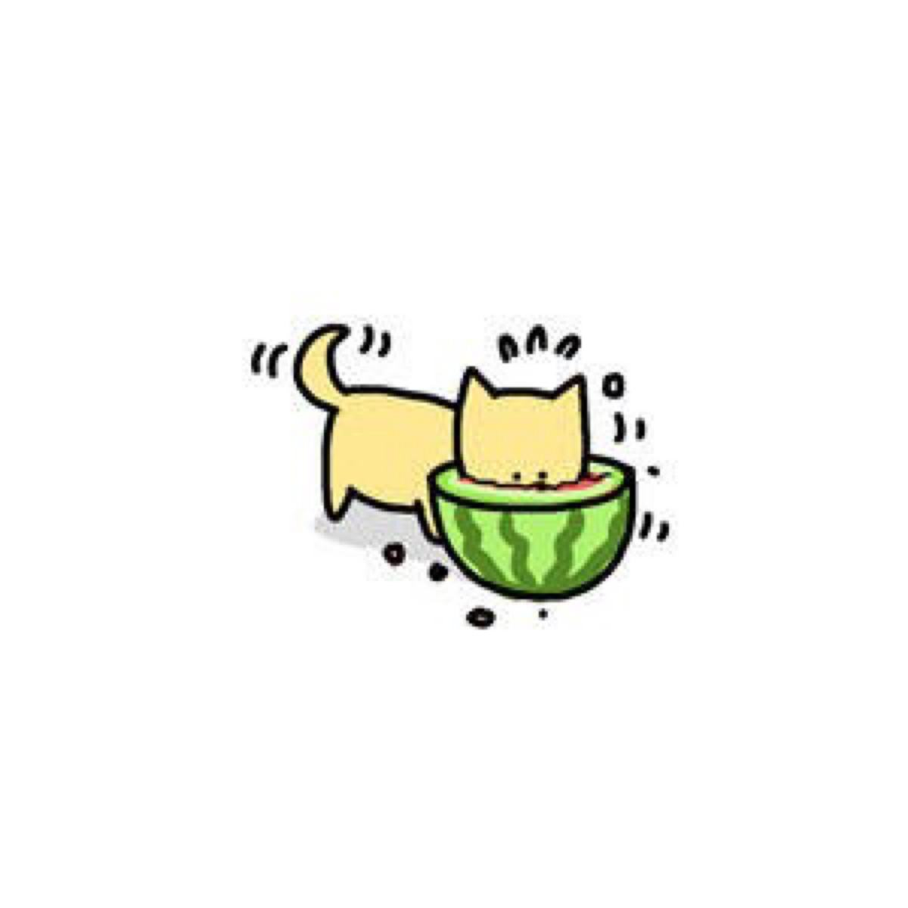
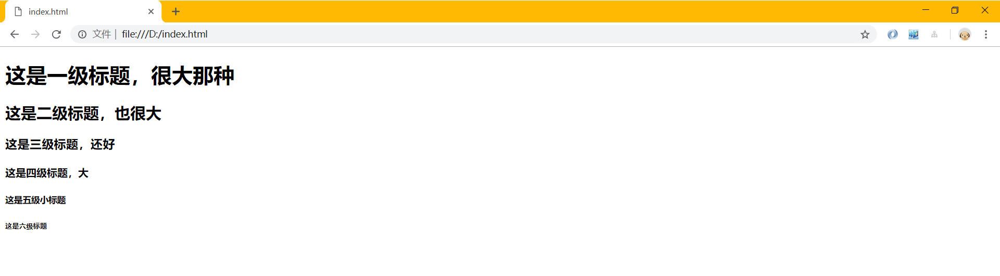
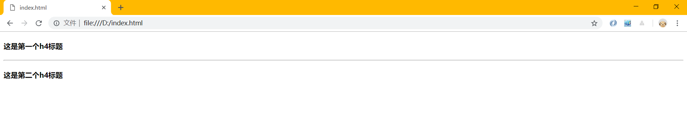
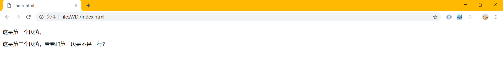
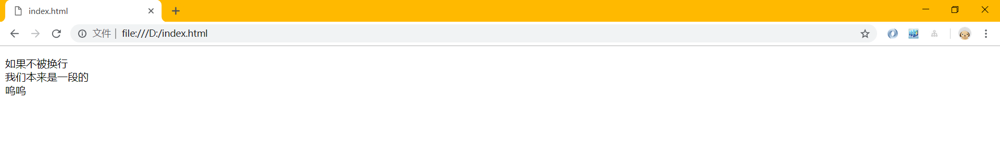
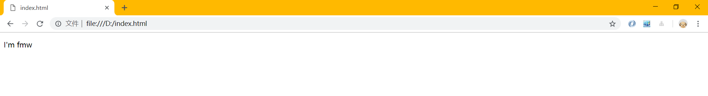

<div align="center">
  <h2><a name="head"></a>📖</h2>
</div>  
<div align="center">
  HTML(在更) / <a href="https://github.com/fmw666/Front-end/blob/master/CSS/README.md#head">CSS(在更)</a> / <a href="https://github.com/fmw666/Front-end/blob/master/JavaScript/README.md#head">JavaScript(在更)</a> / <a href="#">BootStrap</a> / <a href="#">jQuery</a>
</div>

<br>

# HTML 指南

>> 文档为本人所有，如需要转载请先[联系我](https://github.com/fmw666)，⚡特此说明！
<hr/>

*"HTML(HyperText Markup Language)--超文本标记语言，标准通用标记语言下的一个应用。是网页制作必备的编程语言"*



🏷前端学习参考网站
 - [RUNOOB](http://www.runoob.com/)
 - [W3school](http://www.w3school.com.cn/index.html)

## 目录

1. [第一个html文档解析](#第一个html文档解析)
1. [HTML 标题](#HTML-标题)
1. [HTML 段落](#HTML-段落)
1. [HTML 属性](#HTML-属性)
1. [HTML 文本格式化](#HTML-文本格式化)
1. [HTML 超链接](#HTML-超链接)
1. [HTML 头部](#HTML-头部)
1. [HTML 图像](#HTML-图像)
1. [HTML 表格](#HTML-表格)
1. [HTML 列表](#HTML-列表)
1. [HTML 区块](#HTML-区块)
1. [HTML 布局](#HTML-布局)
1. [HTML 表单](#HTML-表单)
1. [HTML 框架](#HTML-框架)
1. [HTML 颜色](#HTML-颜色)
1. [HTML 脚本](#HTML-脚本)
1. [HTML 字符实体](#HTML-字符实体)
1. [HTML URL](#HTML-URL)

## 第一个html文档解析

  <a name="1.1"></a>
  - [1.1](#1.1) **html基本结构**
  
    ```sass
    <!DOCTYPE html>
    <html>
    <head>
        <title>我是网页标题</title>
    </head>
    <body>
        <h1>我是内容标题</h1>
        <p>我是段落</p>
        <!-- 我是注释 -->
    </body>
    </html>
    ```
    
  <a name="1.2"></a>
  - [1.2](#1.2) **`<!DOCTYPE html>` 声明为 HTML5 文档**
  
    + 🎲 [\<!DOCTYPE\>]((#no-jump)) 声明必须是 HTML 文档的第一行，位于 [\<html\>](#no-jump) 标签之前。
    
    + 🎲 向 HTML 文档添加 [\<!DOCTYPE\>](#no-jump) 声明，这样浏览器才能获知文档类型。
    
    + 🎲 [\<!DOCTYPE\>](#no-jump) 声明没有结束标签，并且对大小写不敏感。
    
    + 🎲 HTML5 中只有一种 [\<!DOCTYPE\>](#no-jump) 声明（在 HTML 4.01 中有三种），即：
      ```sass
      <!DOCTYPE html>
      ```
  
  <a name="1.3"></a>
  - [1.3](#1.3) **`<html>` 元素是 HTML 页面的根元素**
  
    + 🕹 [\<html\>](#no-jump) 与 [\</html\>](#no-jump) 标签限定了文档的开始点和结束点。
    
    + 🕹 它们之间是文档的头部和主体，即 [\<head\>](#no-jump) 和 [\<body\>](#no-jump) 标签里的内容。
    
    <div align="center">
      
    </div>
  
  <a name="1.4"></a>
  - [1.4](#1.4) **`<head>` 元素包含了文档的元（meta）数据**
  
    + 💸 [\<head\>](#no-jump) 标签用于定义文档的头部，它是所有头部元素的容器。
    
    + 💸 [\<head\>](#no-jump) 中的元素可以引用脚本、指示浏览器在哪里找到样式表、提供元信息等等。
    
    + 💸 文档的头部描述了文档的各种属性和信息，包括文档的标题、在 Web 中的位置以及和其他文档的关系等。绝大多数文档头部包含的数据都不会真正作为内容显示给读者。
    
    + 💸 下面这些标签可用在 [head](#no-jump) 部分：[\<base\>](#no-jump), [\<link\>](#no-jump), [\<meta\>](#no-jump), [\<script\>](#no-jump), [\<style\>](#no-jump), 以及 [\<title\>](#no-jump)。
    
    + 💸 [\<head\>](#no-jump) 标签放在文档的开始处，紧跟在 [\<html\>](#no-jump) 后面，并处于 [\<body\>](#no-jump) 标签之前。
    
    <div align="center">
      
    </div>
  
  <a name="1.5"></a>
  - [1.5](#1.5) **`<title>` 元素描述了文档的标题**
  
    &emsp;&emsp;💡 浏览器会以特殊的方式来使用标题，并且通常把它放置在浏览器窗口的标题栏或状态栏上。同样，当把文档加入用户的链接列表或者收藏夹或书签列表时，标题将成为该文档链接的默认名称。
    
    <div align="center">
      
    </div>
    
  <a name="1.6"></a>
  - [1.6](#1.6) **`<body>` 元素包含了可见的页面内容(下面讲解的标签基本都写在这个标签里)**
  
    + 🎈 [body](#no-jump) 元素定义文档的主体。 
    
    + 🎈 [body](#no-jump) 元素包含文档的所有内容（比如文本、超链接、图像、表格和列表等等。）
    
    <div align="center">
      
    </div>
    
  <a name="1.7"></a>
  - [1.7](#1.7) **`<!-- -->` 标签里为注释内容**
  
    &emsp;&emsp;🎗 注释可以提高程序的可读性，使代码更容易被别人理解。在大多数编译器里，可通过快捷键 [ctrl](#no-jump) + [/](#no-jump) 来注释一行。
    
    <div align="center">
      
    </div>
  
**[⬆ back to top](#目录)**

## HTML 标题

  <a name="2.1"></a>
  - [2.1](#2.1) **HTML 标题（Heading）通过 `<h1> - <h6>` 等标签定义**
  
    ```sass
    <h1>这是一级标题，很大那种</h1>
    <h2>这是二级标题，也很大</h2>
    <h3>这是三级标题，还好</h3>
    <h4>这是四级标题，大</h4>
    <h5>这是五级小标题</h5>
    <h6>这是六级标题</h6>
    ```
    
    
    
  <a name="2.2"></a>
  - [2.2](#2.2) **标题的重要性及作用**
  
    + 📚 请确保将 HTML 标题 标签只用于标题。不要仅仅是为了生成粗体或大号的文本而使用标题。
    
    + 📚 搜索引擎使用标题为您的网页的结构和内容编制索引。
    
    + 📚 因为用户可以通过标题来快速浏览您的网页，所以用标题来呈现文档结构是很重要的。
    
    + 📚 应该将 h1 用作主标题（最重要的），其后是 h2（次重要的），再其次是 h3，以此类推。
    
    <div align="center">
      
    </div>
    
  <a name="2.3"></a>
  - [2.3](#2.3) **HTML 水平线**
  
    🎯 使用 [\<hr\>](#no-jump) 标签在 HTML 页面中创建水平线。
    
    ```sass
    <h4>这是第一个h4标题</h4>
    <hr>    <!-- 也可以写成<hr /> -->
    <h4>这是第二个h4标题</h4>
    ```
    
    
  
**[⬆ back to top](#目录)**

## HTML 段落

  <a name="3.1"></a>
  - [3.1](#3.1) **HTML 段落通过标签 `<p>` 定义**
  
    ```sass
    <p>这是第一个段落。</p>
    <p>这是第二个段落，看看和第一段是不是一行？</p>
    ```
    
    
    
  <a name="3.2"></a>
  - [3.2](#3.2) **HTML 通过标签 `<br>` 标签进行换行**
  
    ```sass
    <p>如果不被换行<br>我们本来是一段的<br>呜呜</p>
    ```
    
    
    
  <a name="3.3"></a>
  - [3.3](#3.3) **HTML 格式--关于空格问题**
  
    🚀 当显示页面时，浏览器会移除源代码中多余的空格和空行。所有连续的空格或空行都会被算作一个空格。比如如下例子：
  
    ```sass
    <p>I'm           fmw</p>
    ```
  
    
    
**[⬆ back to top](#目录)**

## HTML 属性

  <a name="4.1"></a>
  - [4.1](#4.1) **属性是 HTML 元素提供的附加信息**
  
    + 🥢 属性一般描述于开始标签。如 HTML 链接由 [\<a\>](#no-jump) 标签定义，链接的地址在 [href](#no-jump) 属性中指定。
    
      ```sass
      <a href="https://github.com/fmw666">我就是超链接，点击我即可跳转页面！</a>
      ```
    
    + 🥢 属性总是以名称/值对的形式出现，比如：`name="value"`
    
    + 🥢 属性值应该始终被包括在引号内，双引号是最常用的，不过使用单引号也没有问题。
    
    + 🥢 如果属性值本身就含有双引号，那么必须使用单引号，例如：`name='John "ShotGun" Nelson'`
    
    <div align="center">
      
    </div>
    
  <a name="4.2"></a>
  - [4.2](#4.2) **HTML 属性参考手册**
  
    🍦 下面列出了适用于大多数 HTML 元素的属性：
    
      |属性|描述|
      |:--:|:--|
      |class|为html元素定义一个或多个类名（classname）(类名从样式文件引入)|
      |id|定义元素的唯一id|
      |style|规定元素的行内样式（inline style）|
      |title|描述了元素的额外信息 (作为工具条使用)|
     
**[⬆ back to top](#目录)**
    
## HTML 文本格式化

  <a name="5.1"></a>
  - [5.1](#5.1) **HTML 格式化标签**
  
    + 📚 HTML 使用标签 [\<b\>](#no-jump)("bold") 与 [\<i\>](#no-jump)("italic") 对输出的文本进行格式，如：**粗体** or *斜体*
    
      > 通常标签 [\<strong\>](#no-jump) 替换加粗标签 [\<b\>](#no-jump) 来使用， [\<em\>](#no-jump) 替换 [\<i\>](#no-jump) 标签使用。[\<strong\>](#no-jump) 或者 [\<em\>](#no-jump) 意味着你要呈现的文本是重要的，所以要突出显示。

    + 📚 这些 HTML 标签被称为格式化标签（请查看下方完整标签参考手册）。
    
    <div align="center">
      
    </div>
    
  <a name="5.2"></a>
  - [5.2](#5.2) **HTML 文本格式化标签**
  
    |标签|描述|
    |:---|:------|
    |[\<b\>](#no-jump)|定义粗体文本|
    |[\<em\>](#no-jump)|定义着重文字|
    |[\<i\>](#no-jump)|定义斜体字|
    |[\<small\>](#no-jump)|定义小号字|
    |[\<strong\>](#no-jump)|定义加重语气|
    |[\<sub\>](#no-jump)|定义下标字|
    |[\<sup\>](#no-jump)|定义上标字|
    |[\<ins\>](#no-jump)|定义插入字|
    |[\<del\>](#no-jump)|定义删除字|
    
  <a name="5.3"></a>
  - [5.3](#5.3) **HTML "计算机输出" 标签**
  
    |标签|描述|
    |:---|:------|
    |[\<code\>](#no-jump)|定义计算机代码|
    |[\<kbd\>](#no-jump)|定义键盘码|
    |[\<samp\>](#no-jump)|定义计算机代码样本|
    |[\<var\>](#no-jump)|定义变量|
    |[\<pre\>](#no-jump)|定义预格式文本|
    
  <a name="5.4"></a>
  - [5.4](#5.4) **HTML 引文、引用、及标签定义**
  
    |标签|描述|
    |:---|:------|
    |[\<abbr\>](#no-jump)|定义缩写|
    |[\<address\>](#no-jump)|定义地址|
    |[\<bdo\>](#no-jump)|定义文字方向|
    |[\<blockquote\>](#no-jump)|定义长的引用|
    |[\<q\>](#no-jump)|定义短的引用语|
    |[\<cite\>](#no-jump)|定义引用、引证|
    |[\<dfn\>](#no-jump)|	定义一个定义项目|

**[⬆ back to top](#目录)**

## HTML 超链接
    
  <a name="6.1"></a>
  - [6.1](#6.1) **HTML 超链接通过标签 `<a>` 定义**
  
    + 🏹 超链接可以是一个字，一个词，或者一组词，也可以是一幅图像，您可以点击这些内容来跳转到新的文档或者当前文档中的某个部分。
    
    + 🏹 当您把鼠标指针移动到网页中的某个链接上时，箭头会变为一只小手。
    
    + 🏹 在标签<a> 中使用了href属性来描述链接的地址。
  
      ```sass
      <a href="url">链接文本</a>
      ```

    <div align="center">
      
    </div>
    
  <a name="6.2"></a>
  - [6.2](#6.2) **HTML 超链接 -- target 属性**
  
    📁 使用 target 属性，你可以定义被链接的文档在何处显示。
    
    ```sass
    <a href="https://fmw666.github.io/" target="_blank">访问我的博客!</a>
    ```
    
  <a name="6.3"></a>
  - [6.3](#6.3) **HTML 超链接 -- id 属性**
  
    + 🎧 id 属性可用于创建在一个 HTML 文档书签标记。
    
    + 🎧 在 HTML 文档中插入 id:
    
      ```sass
      <a id="tips">有用的提示部分</a>
      ```
      
    + 🎧 在 HTML 文档中创建一个链接到"有用的提示部分(id="tips"）"：
    
      ```sass
      <a href="#tips">访问有用的提示部分</a>
      ```
      
    + 🎧 或者，从另一个页面创建一个链接到"有用的提示部分(id="tips"）"：
    
      ```sass
      <a href="https://github.com/fmw666/Front-end/tree/master/HTML#tips">访问有用的提示部分</a>
      ```
      
    <div align="center">
      
    </div>
    
**[⬆ back to top](#目录)** 

## HTML 头部

  <a name="7.1></a>
  - [7.1](#7.1) **HTML `<head>` 元素**
  
    + 🎓 [\<head\>](#no-jump) 元素包含了所有的头部标签元素。
    
    + 🎓 在 [\<head\>](#no-jump) 元素中你可以插入脚本（scripts）, 样式文件（CSS），及各种 meta 信息。
    
    + 🎓 可以在头部区域添加的元素标签为: [\<title\>](#no-jump)、[\<style\>](#no-jump)、[\<meta\>](#no-jump)、[\<link\>](#no-jump)、[\<script\>](#no-jump)、[\<noscript\>](#no-jump)、[\<base\>](#no-jump)
    
      |标签|描述|
      |:---|:------|
      |[\<title\>](#no-jump)|定义了文档的标题|
      |[\<style\>](#no-jump)|定义了HTML文档的样式文件|
      |[\<meta\>](#no-jump)|定义了HTML文档中的元数据|
      |[\<link\>](#no-jump)|定义了一个文档和外部资源之间的关系|
      |[\<script\>](#no-jump)|定义了客户端的脚本文件|
      |[\<base\>](#no-jump)|定义了页面链接标签的默认链接地址|
